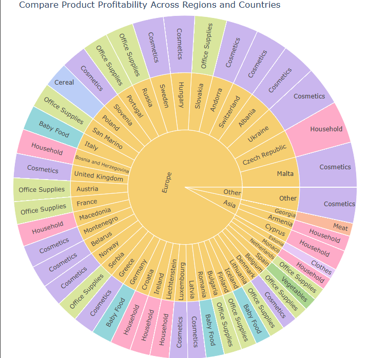

# Sales Data Analysis



An in-depth analysis of sales transactions to uncover revenue patterns, product performance, and strategic sales insights across multiple years.

---

## Project Overview  
This project analyzes historical sales records using structured data from events, products, and countries to uncover insights such as:

- Top-performing products by revenue and quantity  
- Revenue trends across different time periods  
- Sales channel performance and priority analysis  
- Product category trends and pricing behavior  
- Regional sales distribution by country and region  

---

## Table of Contents  
- [Setup](#setup)  
- [Data Structure](#data-structure)  
- [Key Features](#key-features)  
- [Main Findings](#main-findings)  
- [Visualizations](#visualizations)  
- [Future Work](#future-work)  

---

## Setup  

### Prerequisites  
- Python 3.x  
- Jupyter Notebook  

### Required Packages  
- `pandas`  
- `numpy`  
- `matplotlib`  
- `seaborn`  

### Installation  
Clone this repository:
```bash
git clone https://github.com/your-username/sales-analysis.git
cd sales-analysis
```

Install required packages:
```bash
pip install -r requirements.txt
```

Run the notebook:
```bash
jupyter notebook "Sales Analysis.ipynb"
```

---

## Data Structure  
The dataset is organized across three main tables:

### Events Table  
~1,330 rows  
Contains transaction-level data:  
- `Order ID`, `Order Date`, `Ship Date`, `Order Priority`  
- `Country Code`, `Product ID`, `Sales Channel`  
- `Units Sold`, `Unit Price`, `Unit Cost`  

### Products Table  
Contains product metadata:  
- `Product ID`, `Item Type` (product category)

### Countries Table  
Includes ISO country codes and location metadata:  
- `Country Name`, `Alpha-2`, `Alpha-3`, `Region`, `Sub-region`

---

## Key Features  

- **Relational Data Analysis** using product and country linkages  
- **Revenue, Cost, and Profit Trends** by year and month  
- **Product-Level Insights**: identifying best and worst performers  
- **Sales Channel Breakdown** (Online vs Offline)  
- **Order Priority Impact** on revenue  
- **Category-Level Analysis** for menu optimization

---

## Main Findings  

### Product & Category Insights  
- Certain categories drive the highest revenue and profit  
- Products with high unit price tend to yield higher margins  
- Popularity (units sold) and profitability don't always align

### Time-Based Patterns  
- Revenue peaks vary by year, with visible seasonality  
- Sales increase significantly in certain months (e.g., Q4)  
- Profitability tends to follow volume but is influenced by cost structure  

### Channel & Priority  
- Offline and online sales channels differ in performance  
- High-priority orders don’t always correlate with highest revenue

---

## Visualizations  

- Pie charts: Revenue/quantity contribution by product  
- Bar charts: Yearly and monthly trends of revenue and profit  
- Heatmaps: Sales performance by category and year  
- Boxplots: Distribution of unit prices and costs  
- Scatter plots: Units sold vs profitability  

---

## Future Work  

- Include customer-level data for segmentation analysis  
- Build predictive models for forecasting future sales  
- Explore product bundling opportunities using market basket analysis  
- Create a Streamlit dashboard for interactive reporting  
- Integrate marketing spend data for ROI analysis
